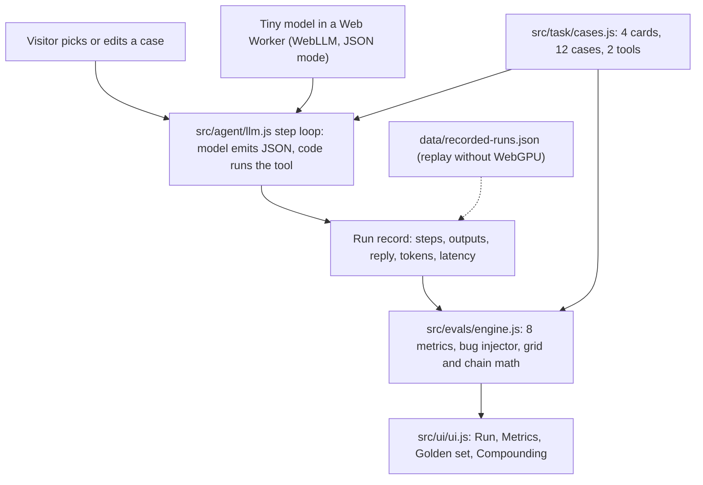

# Design

```mermaid
flowchart TD
  U["Visitor picks or edits a case"] --> L
  M["Tiny model in a Web Worker (WebLLM, JSON mode)"] --> L
  L["src/agent/llm.js step loop: model emits JSON, code runs the tool"] --> R
  R["Run record: steps, outputs, reply, tokens, latency"] --> E
  E["src/evals/engine.js: 8 metrics, bug injector, grid and chain math"] --> V
  V["src/ui/ui.js: Run, Metrics, Golden set, Compounding"]
  F["data/recorded-runs.json (replay without WebGPU)"] -.-> R
  C["src/task/cases.js: 4 cards, 12 cases, 2 tools"] --> L
  C --> E
```

Nodes match `DISCOVERY.md`: engine, ui, model-gate, replay.
